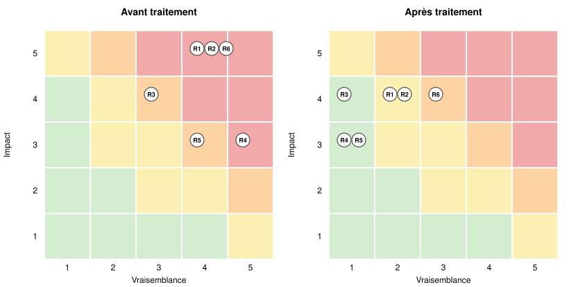

# Étude de cas : violation de données Free Mobile / Free (octobre 2024)

> **Avertissement.** Analyse externe et indépendante, fondée uniquement sur des sources publiques (décision et communiqué de la CNIL). Elle ne décrit pas l'état interne actuel des sociétés concernées : les faits renvoient aux sources, les cotations sont un jugement d'analyste à visée pédagogique.

## Contexte

Entre le 28 septembre et le 22 octobre 2024, un attaquant s'est connecté au réseau privé virtuel (VPN) de l'opérateur, puis à l'outil de gestion des abonnés, et a accédé aux données de plus de 24 millions de contrats. À la suite de plus de 2 500 plaintes, la CNIL a sanctionné Free Mobile (27 M€) et Free (15 M€) en janvier 2026 pour des manquements aux articles 32, 34 et 5-1-e du RGPD. Cette étude reprend ces manquements comme scénarios de risque, les rattache aux référentiels ISO/IEC 27001:2022 et NIST CSF 2.0, et propose un plan de traitement.

## Synthèse

| Niveau | Avant traitement | Après traitement |
|---|---:|---:|
| 🟥 critique | 4 | 0 |
| 🟧 élevé | 2 | 1 |
| 🟨 moyen | 0 | 2 |
| 🟩 faible | 0 | 3 |

Score moyen : **16,5** avant traitement, **6,3** après (soit **-62 %**).

## Registre des risques

| ID | Risque | V | I | Score | Niveau | Confiance | Horizon |
|---|---|:-:|:-:|:-:|---|---|---|
| R1 | Compromission de l'accès distant (VPN) | 4 | 5 | 20 | 🟥 critique | élevée | 0-3 mois |
| R2 | Extraction massive de données non détectée | 4 | 5 | 20 | 🟥 critique | élevée | 0-3 mois |
| R6 | Réutilisation des données volées (hameçonnage, fraude) | 4 | 5 | 20 | 🟥 critique | moyenne | 0-3 mois |
| R4 | Données d'anciens abonnés conservées trop longtemps | 5 | 3 | 15 | 🟥 critique | élevée | 0-3 mois |
| R3 | Comptes de l'outil de gestion exposés (stockage faible des mots de passe) | 3 | 4 | 12 | 🟧 élevé | moyenne | 3-6 mois |
| R5 | Information insuffisante des personnes concernées | 4 | 3 | 12 | 🟧 élevé | élevée | 3-6 mois |

## Fiches risque

### R1 : Compromission de l'accès distant (VPN)

**Scénario.** Un attaquant disposant d'identifiants valides se connecte au VPN d'entreprise, qui ne vérifie ni le poste utilisé ni un second facteur, puis progresse vers les systèmes internes.

**Faits.**
- La CNIL juge la procédure d'authentification au VPN insuffisamment robuste (article 32 du RGPD). [S1]
- L'authentification multifacteur des utilisateurs et l'authentification du poste nomade (certificat machine) faisaient défaut sur l'accès distant. [S2]
- L'attaquant s'est d'abord connecté au VPN, puis à l'outil de gestion des abonnés. [S2]

**Référentiels.**
- ISO/IEC 27001:2022 : A.8.5 Authentification sécurisée, A.5.15 Contrôle d'accès, A.5.17 Informations d'authentification, A.8.20 Sécurité des réseaux, A.6.7 Télétravail
- NIST CSF 2.0 : PR.AA (Identity Management, Authentication, and Access Control)
- Réglementation : RGPD, art. 32

**Traitement : Réduire.**
- Authentification multifacteur obligatoire sur tous les accès distants
- Authentification du poste par certificat machine avant l'ouverture du VPN
- Segmentation : limiter ce que voit un utilisateur VPN au strict nécessaire

Risque inhérent : 4 × 5 = **20** (🟥 critique). Risque résiduel visé : 2 × 4 = **8** (🟨 moyen). Confiance dans la cotation : élevée.

### R2 : Extraction massive de données non détectée

**Scénario.** Une fois dans l'outil de gestion des abonnés, l'attaquant interroge la base à grande échelle sans déclencher d'alerte, et l'extraction dure plusieurs semaines.

**Faits.**
- La CNIL juge les mesures de détection des comportements anormaux inefficaces (article 32 du RGPD). [S1]
- Le dispositif d'analyse des connexions VPN s'est avéré inefficace face à l'attaque. [S2]
- Seule la fonctionnalité « consultation » de l'outil de gestion des abonnés était analysée par un système générant des alertes. [S2]
- L'attaque s'est déroulée du 28 septembre au 22 octobre 2024 ; elle a duré près de quatre semaines. [S2]

**Référentiels.**
- ISO/IEC 27001:2022 : A.8.16 Activités de surveillance, A.8.15 Journalisation, A.5.25 Appréciation et décision sur les événements de sécurité, A.5.24 Planification et préparation de la gestion des incidents
- NIST CSF 2.0 : DE.CM (Continuous Monitoring), DE.AE (Adverse Event Analysis)
- Réglementation : RGPD, art. 32

**Traitement : Réduire.**
- Journaliser toutes les fonctions de l'outil, pas seulement la consultation
- Alertes sur les volumes de requêtes et d'exports par compte et par session
- Corréler VPN, réseau interne et journaux applicatifs dans un outil de supervision

Risque inhérent : 4 × 5 = **20** (🟥 critique). Risque résiduel visé : 2 × 4 = **8** (🟨 moyen). Confiance dans la cotation : élevée.

### R6 : Réutilisation des données volées (hameçonnage, fraude)

**Scénario.** Les données exfiltrées (identité, coordonnées, contrat, IBAN) servent à des campagnes d'hameçonnage ciblé et à des tentatives de fraude au prélèvement.

**Faits.**
- Les données concernées comprennent identité, coordonnées, données contractuelles, date et lieu de naissance, identifiant client et, pour les clients des deux sociétés, l'IBAN. [S2]
- L'usage malveillant de ces données (hameçonnage, fraude) est une conséquence plausible de leur exposition ; la décision ne le constate pas. *(analyse, non sourcé)*

**Référentiels.**
- ISO/IEC 27001:2022 : A.5.26 Réponse aux incidents de sécurité, A.5.34 Vie privée et protection des données personnelles
- NIST CSF 2.0 : RS.CO (Incident Response Reporting and Communication)
- Réglementation : RGPD, art. 34

**Traitement : Réduire.**
- Alerter les clients sur les risques d'hameçonnage et de fraude au prélèvement
- Surveiller les motifs de fraude liés aux comptes exposés

Risque inhérent : 4 × 5 = **20** (🟥 critique). Risque résiduel visé : 3 × 4 = **12** (🟧 élevé). Confiance dans la cotation : moyenne.

### R4 : Données d'anciens abonnés conservées trop longtemps

**Scénario.** Des millions de dossiers d'anciens abonnés restent dans les systèmes sans justification : en cas de compromission, le nombre de personnes touchées augmente sans aucune utilité pour l'entreprise.

**Faits.**
- Free Mobile n'avait pas mis en place de tri des données des anciens abonnés pour ne conserver que ce qui était nécessaire à des fins comptables avant suppression (article 5-1-e du RGPD). [S1]
- Environ trois millions de contrats résiliés (sur quinze millions) étaient conservés depuis plus de dix ans. [S2]

**Référentiels.**
- ISO/IEC 27001:2022 : A.8.10 Suppression d'informations, A.5.33 Protection des enregistrements, A.5.34 Vie privée et protection des données personnelles, A.5.31 Exigences légales, réglementaires et contractuelles
- NIST CSF 2.0 : GV.PO (Policy), PR.DS (Data Security)
- Réglementation : RGPD, art. 5-1-e

**Traitement : Réduire.**
- Fixer des durées de conservation par catégorie de données et les faire appliquer par le système
- Purger les dossiers échus, n'archiver que le nécessaire comptable, en accès restreint

Risque inhérent : 5 × 3 = **15** (🟥 critique). Risque résiduel visé : 1 × 3 = **3** (🟩 faible). Confiance dans la cotation : élevée.

### R3 : Comptes de l'outil de gestion exposés (stockage faible des mots de passe)

**Scénario.** Les mots de passe des utilisateurs de l'outil de gestion sont stockés avec un mécanisme trop faible ; une fuite de la base de comptes permet de les retrouver et de les réutiliser.

**Faits.**
- Les mots de passe des utilisateurs de l'outil n'étaient pas protégés par l'un des algorithmes recommandés par l'ANSSI et la CNIL (Argon2, yescrypt, scrypt, balloon, bcrypt ou, dans une moindre mesure, PBKDF2). [S2]
- La vraisemblance est estimée à 3 : la faiblesse est avérée, mais rien n'établit qu'elle ait été exploitée dans cet incident. *(analyse, non sourcé)*

**Référentiels.**
- ISO/IEC 27001:2022 : A.8.24 Utilisation de la cryptographie, A.5.17 Informations d'authentification, A.8.5 Authentification sécurisée
- NIST CSF 2.0 : PR.AA (Identity Management, Authentication, and Access Control), PR.DS (Data Security)
- Réglementation : RGPD, art. 32

**Traitement : Réduire.**
- Hachage des mots de passe avec Argon2id ou bcrypt, et rehachage à la prochaine connexion
- Authentification multifacteur sur l'outil lui-même

Risque inhérent : 3 × 4 = **12** (🟧 élevé). Risque résiduel visé : 1 × 4 = **4** (🟩 faible). Confiance dans la cotation : moyenne.

### R5 : Information insuffisante des personnes concernées

**Scénario.** Après une violation, le message envoyé aux clients n'explique pas les conséquences ni les gestes de protection, ce qui les laisse exposés et expose l'entreprise à une sanction.

**Faits.**
- Le courriel de notification ne comprenait pas toutes les informations nécessaires : conséquences de la violation et mesures que les personnes pouvaient prendre pour se protéger (article 34 du RGPD). [S1]

**Référentiels.**
- ISO/IEC 27001:2022 : A.5.26 Réponse aux incidents de sécurité, A.5.24 Planification et préparation de la gestion des incidents, A.5.5 Contacts avec les autorités, A.5.34 Vie privée et protection des données personnelles, A.5.31 Exigences légales, réglementaires et contractuelles
- NIST CSF 2.0 : RS.CO (Incident Response Reporting and Communication)
- Réglementation : RGPD, art. 34

**Traitement : Réduire.**
- Modèle de notification validé à l'avance par le DPO et le juridique
- Inclure conséquences probables, mesures de protection et point de contact
- Exercice annuel de gestion de crise incluant la communication

Risque inhérent : 4 × 3 = **12** (🟧 élevé). Risque résiduel visé : 1 × 3 = **3** (🟩 faible). Confiance dans la cotation : élevée.

## Couverture ISO/IEC 27001 (Annexe A)

16 contrôles de l'Annexe A (sur 93) sont concernés.

| Contrôle | Intitulé | Risques |
|---|---|---|
| A.5.5 | Contacts avec les autorités | R5 |
| A.5.15 | Contrôle d'accès | R1 |
| A.5.17 | Informations d'authentification | R1, R3 |
| A.5.24 | Planification et préparation de la gestion des incidents | R2, R5 |
| A.5.25 | Appréciation et décision sur les événements de sécurité | R2 |
| A.5.26 | Réponse aux incidents de sécurité | R6, R5 |
| A.5.31 | Exigences légales, réglementaires et contractuelles | R4, R5 |
| A.5.33 | Protection des enregistrements | R4 |
| A.5.34 | Vie privée et protection des données personnelles | R6, R4, R5 |
| A.6.7 | Télétravail | R1 |
| A.8.5 | Authentification sécurisée | R1, R3 |
| A.8.10 | Suppression d'informations | R4 |
| A.8.15 | Journalisation | R2 |
| A.8.16 | Activités de surveillance | R2 |
| A.8.20 | Sécurité des réseaux | R1 |
| A.8.24 | Utilisation de la cryptographie | R3 |

## Feuille de route

L'horizon découle du niveau du risque inhérent : critique 0-3 mois, élevé 3-6 mois, moyen ou faible 6-12 mois.

### 0-3 mois

- **R1** (🟥 critique) : Authentification multifacteur obligatoire sur tous les accès distants ; Authentification du poste par certificat machine avant l'ouverture du VPN ; Segmentation : limiter ce que voit un utilisateur VPN au strict nécessaire
- **R2** (🟥 critique) : Journaliser toutes les fonctions de l'outil, pas seulement la consultation ; Alertes sur les volumes de requêtes et d'exports par compte et par session ; Corréler VPN, réseau interne et journaux applicatifs dans un outil de supervision
- **R6** (🟥 critique) : Alerter les clients sur les risques d'hameçonnage et de fraude au prélèvement ; Surveiller les motifs de fraude liés aux comptes exposés
- **R4** (🟥 critique) : Fixer des durées de conservation par catégorie de données et les faire appliquer par le système ; Purger les dossiers échus, n'archiver que le nécessaire comptable, en accès restreint

### 3-6 mois

- **R3** (🟧 élevé) : Hachage des mots de passe avec Argon2id ou bcrypt, et rehachage à la prochaine connexion ; Authentification multifacteur sur l'outil lui-même
- **R5** (🟧 élevé) : Modèle de notification validé à l'avance par le DPO et le juridique ; Inclure conséquences probables, mesures de protection et point de contact ; Exercice annuel de gestion de crise incluant la communication

## Sources

- [S1] CNIL, Violation de données : sanction de 42 millions d'euros à l'encontre des sociétés FREE MOBILE et FREE, 2026-01-14 : <https://www.cnil.fr/fr/sanction-free-2026>
- [S2] CNIL, Délibération SAN-2026-001 (FREE MOBILE), Légifrance, 2026-01 : <https://www.legifrance.gouv.fr/cnil/id/CNILTEXT000053352664>

## Méthode

- **Score** = vraisemblance (1 à 5) × impact (1 à 5). Seuils : critique ≥ 15, élevé 10 à 14, moyen 5 à 9, faible ≤ 4.
- **Confiance** : *élevée* si tous les faits d'un risque sont sourcés, *moyenne* si certains relèvent de l'analyse, *faible* si aucun n'est sourcé.
- Les cotations sont un jugement d'analyste ; les faits, eux, renvoient à une source.
